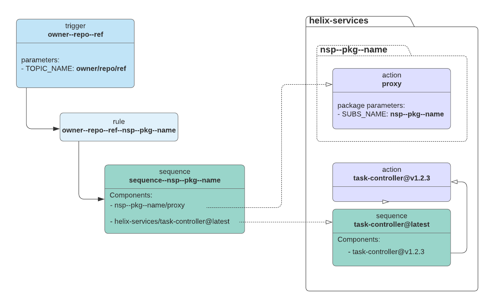

# Add New Observation Task

> **THIS IS STILL A DRAFT**

## set up subscription

1. get clientId from word2md
2. run `1d login --u helix@adobe.com`
3. resolve your sharelink root: 
   ```
   $ 1d resolve <sharelink from fstab.yaml>
   ```
   copy the `driveId`

5. get the `client-state` secret from the helix-onedrive-listener/secrets/secrets.env :-)   
4. create subscription: 
   ```
   $ 1d sub create \
     /drives/<driveId>/root \
     'https://adobeioruntime.net/api/v1/web/helix-index/helix-observation/onedrive-listener@latest/hook?owner=tripodsan&repo=helix-pages-test&ref=master' \
     <client-state>
   ```
   
## set up service bus

1. go to [service bus in azure portal](https://portal.azure.com/#@adobe.onmicrosoft.com/resource/subscriptions/07d1d753-4bfc-4012-9958-35592a40a3fa/resourceGroups/helix-prod/providers/Microsoft.ServiceBus/namespaces/hlxobs/topics) 
2. create new topic: `tripodsan/helix-pages-test/master`
3. go to the topic
4. create a new subscription: `cache-flush`

## set up task-controller

So goal is to create a trigger for the repository that is observed, which will invoke all the task-controllers that are
subscribed to it. currently this is only possible by creating a bunch of openwhisk objects



- The `trigger` is triggered and sets the `TOPIC_NAME` param to the payload.
- Via the `rule` it invokes the `sequence` that has 2 components:
  - the `bound/proxy` action, that lives in the bound package and adds the `SUBSCRIPTION` param to the payload
  - the `controller@latest` action, which is a sequence that contains the real `controller@v1.2.3` action.
  

1. create new trigger for your repository
   ```
   $ wsk trigger create \
       tripodsan--helix-pages-test--master \
       -p AZURE_SERVICE_BUS_TOPIC_NAME tripodsan/helix-pages-test/master
   ```
2. create a bound wsk package for your subscription and task
   ```   
   $ wsk package bind \
       /helix/helix-observation \
       subscription-cache-flush \
       -p AZURE_SERVICE_BUS_SUBSCRIPTION_NAME cache-flush \
       -p taskActionName /helix-index/helix-observation/cache-flush@latest
   ```
3. create a sequence that invokes the controller
   ```
   $ wsk action create --sequence \
       subscription-cache-flush-sequence \
       subscription-cache-flush/proxy, \
       subscription-cache-flush/task-controller@latest
   ```
4. create a rule that links the trigger to the sequence:
   ```
   $ wsk rule create \
       tripodsan--helix-pages-test--master--cache-flush \
       tripodsan--helix-pages-test--master \
       subscription-cache-flush-sequence
   ```
   
   
