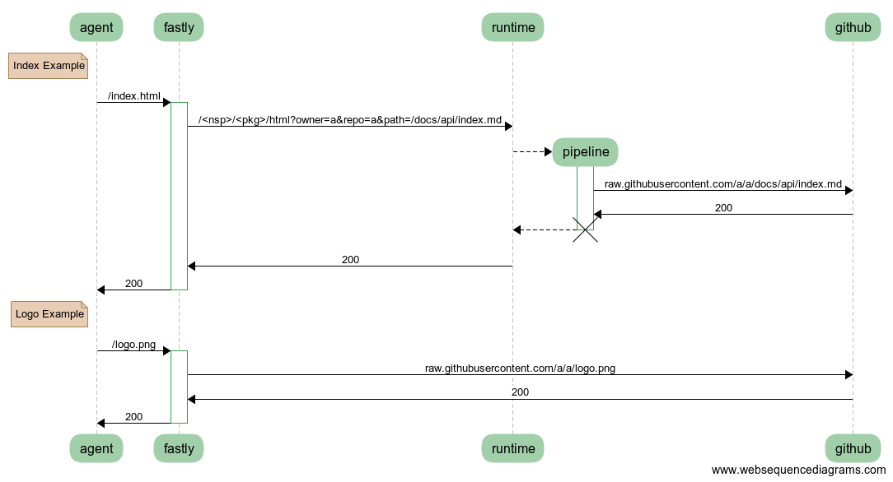
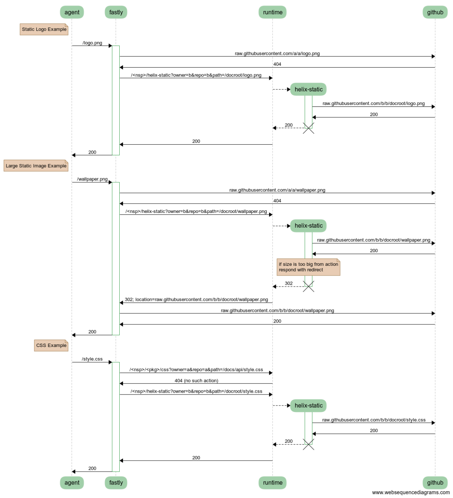

# Static Request Processing

`htdocs` is just the default path of the `static.url` of a strain. you can change it if you like. but let's stick to the defaults.

during `hlx publish`, the `static.url` will be added to the edge dictionaries of the VLC and will be used when looking for a resource.

in general: the _path_ in a giturl acts like a _chroot_ and the requested paths will be resolved relative to it. e.g. if the giturl is `https://github.com/adobe/project-helix.io.git/docs/api` and you try to resolve `/index.html` against this strain/url, it will try to fetch `https://github.com/adobe/project-helix.io.git/docs/api/index.md`.

the resolution of any request works like this:

1. if the `extension` of the request path looks like an image, try to fetch the resource directly from the **content repository**
2. else append `.md` to the resource path, invoke the pipeline which fetches the resource from the **content repository**
3. if the response of (1) or (2) is `404`, try to fetch the original path from the **static repository**.
4. if this fails, send a 404.

so for example, having a strain with:

```yaml
strains:
   - name: default
     content: https://github.com/a/a.git/docs/api#master
     static: https://github.com/b/b.git/docroot#master
```

requesting `/logo.png` would try to fetch from:
1. `https://raw.githubusercontent.com/a/a.git/docs/api/logo.png`
2. `https://raw.githubusercontent.com/b/b.git/docroot/logo.png` (using helix--static)

requesting `/index.html` would try:
1. `https://adobeioruntime.net/x/x/html?repo=a&owner=a&path=/docs/api/index.md`
2. `https://raw.githubusercontent.com/b/b.git/docroot/index.html` (using helix--static)

requesting `/style.css` would try:
1. `https://adobeioruntime.net/x/x/css?repo=a&owner=a&path=/docs/api/style.md`
2. `https://raw.githubusercontent.com/b/b.git/docroot/style.css` (using `helix--static`)

what is missing to solve the problem of this issue is an attempt to fetch the `css` directly from the content repository first.

In general, I think that we should treat all requests the same, maybe optimize the order somehow by providing manifests for faster lookup:

the order should be: **dynamic** -> **content** -> **static**

i.e.

1. call runtime `{extension}` action, passing the `resourcePath` and **content repository**
2. if fails, try to fetch the content from the **content repository** directly (raw.githubusercontent)
3. if fails, invoke `helix--static`, which tries to fetch from the **static repository** (using the `helix--static` runtime action)

---

## Processing of html page request



```
note left of agent: Index Example
agent->+fastly: /index.html
fastly->runtime: /<nsp>/<pkg>/html?owner=a&repo=a&path=/docs/api/index.md
runtime-->*+pipeline:
pipeline->github: raw.githubusercontent.com/a/a/docs/api/index.md
github->pipeline: 200
pipeline-->runtime:
destroy pipeline
runtime->fastly: 200
fastly->agent: 200
deactivate fastly

note left of agent: Logo Example
agent->+fastly: /logo.png
fastly->github: raw.githubusercontent.com/a/a/logo.png
github->fastly: 200
fastly->agent: 200
deactivate fastly
```

## Processing of static page request



```
participant agent
participant fastly
participant runtime
participant helix-static
note left of agent: Static Logo Example 
agent->+fastly: /logo.png
fastly->github: raw.githubusercontent.com/a/a/logo.png
github->fastly: 404
fastly->runtime: /<nsp>/helix-static?owner=b&repo=b&path=/docroot/logo.png
runtime-->*+helix-static:
helix-static->github: raw.githubusercontent.com/b/b/docroot/logo.png
github->helix-static: 200
helix-static-->runtime: 200
destroy helix-static
runtime->fastly: 200
fastly->agent: 200
deactivate fastly

note left of agent: Large Static Image Example 
agent->+fastly: /wallpaper.png
fastly->github: raw.githubusercontent.com/a/a/wallpaper.png
github->fastly: 404
fastly->runtime: /<nsp>/helix-static?owner=b&repo=b&path=/docroot/wallpaper.png
runtime-->*+helix-static:
helix-static->github: raw.githubusercontent.com/b/b/docroot/wallpaper.png
github->helix-static: 200
note over helix-static: if size is too big from action\nrespond with redirect
helix-static-->runtime: 302
destroy helix-static
runtime->fastly: 302; location=raw.githubusercontent.com/b/b/docroot/wallpaper.png
fastly->github: raw.githubusercontent.com/b/b/docroot/wallpaper.png
github->fastly: 200
fastly->agent: 200
deactivate fastly

note left of agent: CSS Example 
agent->+fastly: /style.css
fastly->runtime: /<nsp>/<pkg>/css?owner=a&repo=a&path=/docs/api/style.css
runtime->fastly: 404 (no such action)
fastly->runtime: /<nsp>/helix-static?owner=b&repo=b&path=/docroot/style.css
runtime-->*+helix-static:
helix-static->github: raw.githubusercontent.com/b/b/docroot/style.css
github->helix-static: 200
helix-static-->runtime: 200
destroy helix-static
runtime->fastly: 200
fastly->agent: 200
deactivate fastly
```


